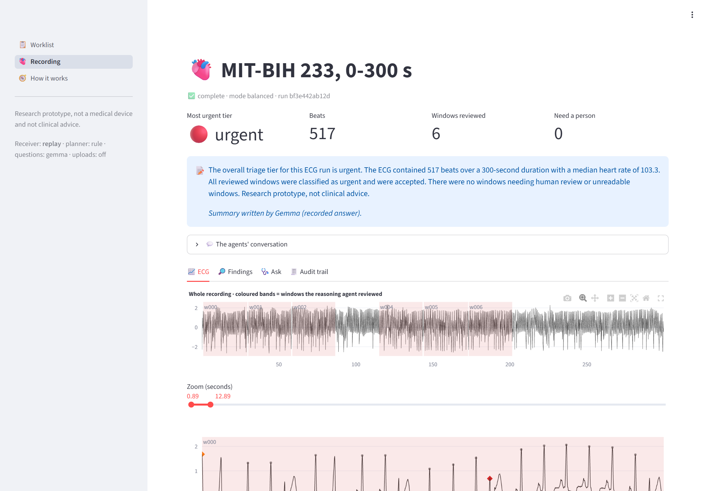
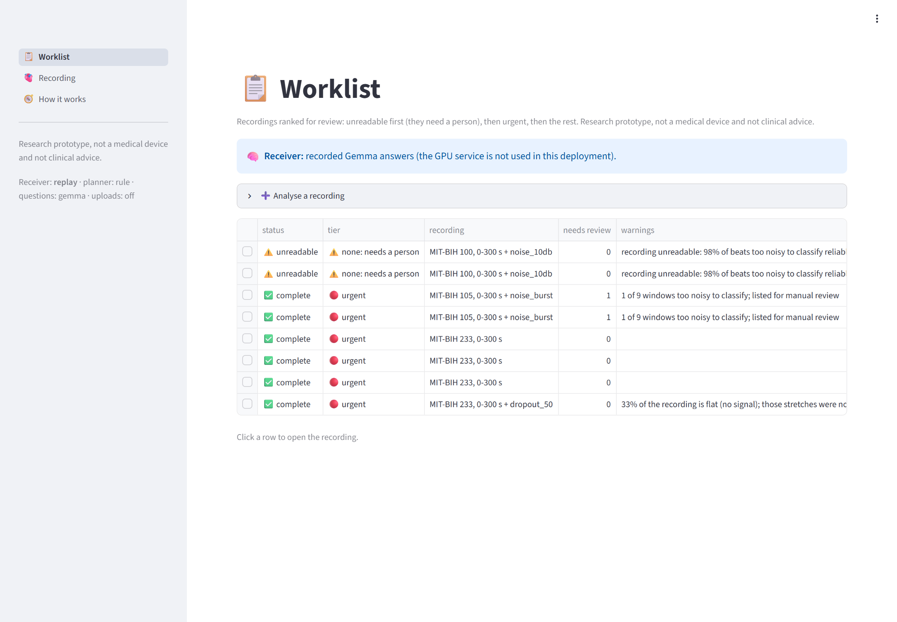
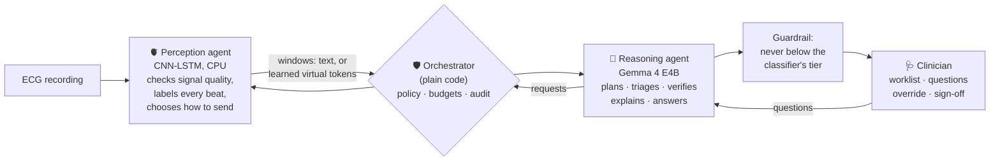
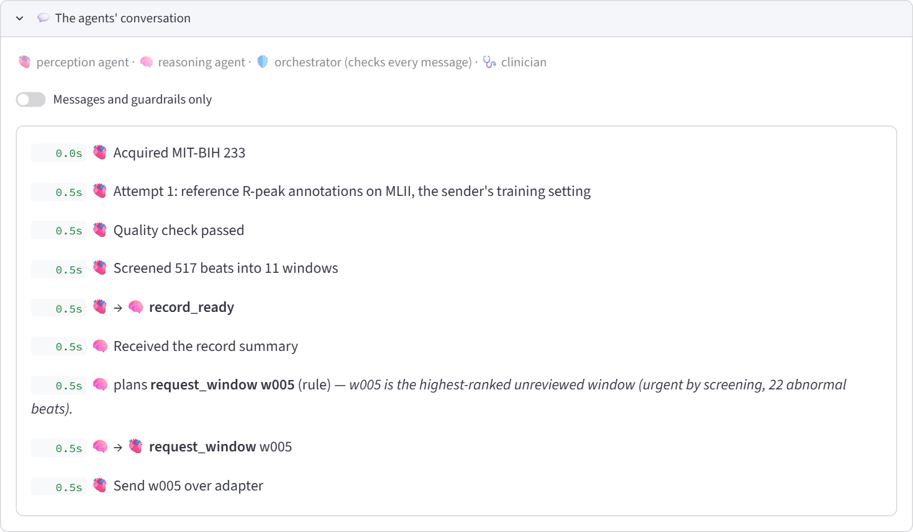
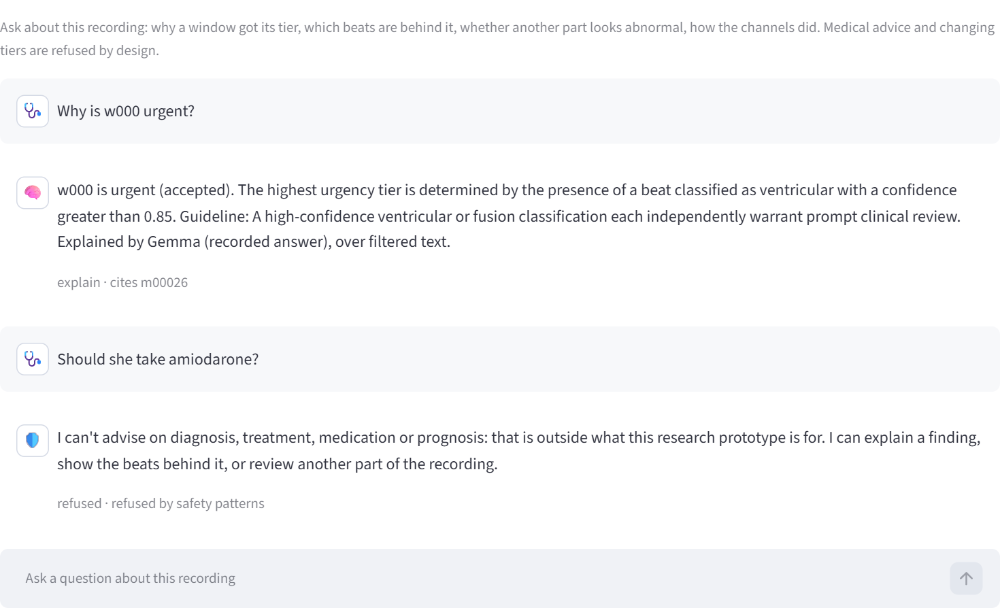

# ECG multi-agent triage

**Two cooperating AI agents that pre-review long ECG recordings for a clinician's worklist, with guardrails that
never let a language model lower the urgency of a finding.**

**▶ Live demo: https://ecg-multi-agent-triage.streamlit.app** · free hosting, may take a moment to wake ·
research prototype, not a medical device or clinical advice

[](https://github.com/a1if/ecg-multi-agent-triage/actions/workflows/ci.yml)




## The problem

A cardiac monitoring service reviews 24-72 hour ECG recordings every morning: about 100,000 heartbeats each. A
recording with a dangerous run of ventricular beats can wait in the queue behind fifty normal ones. This system
pre-reviews each recording and ranks the worklist, with evidence, so the urgent ones are seen first. A clinician
still decides.



## How it works



- **Two agents with separate jobs.** The perception agent (a CNN-LSTM, no LLM) reads the signal, checks it can be
  trusted, and decides *how* to describe each window: every beat as text, only abnormal beats as text, or compact
  learned vectors that the language model reads as **virtual tokens**. The reasoning agent (Gemma, self-hosted)
  decides *what* to look at within a budget, triages, explains, and answers questions. It never sees the signal; it
  can only ask.
- **They communicate through typed messages, and a deterministic orchestrator checks every one** against what its
  sender may say (an allowlist, request/reply matching, and for virtual-token messages a shape, range and
  model-version contract). Anything else is refused and logged.
- **Safety lives in code, not in prompts.** The urgent-beat rule runs on CPU in milliseconds; the LLM can make a
  recording *more* urgent, never less. A lower answer is rejected and the window re-sent over a more accurate channel;
  if every channel fails, the rule's tier stands and a person is asked.

Design notes, including stakeholders, autonomy levels, the hazard log and every trade-off: [docs/design.md](docs/design.md).

### The agents talking



### Asking about a finding, and a question it must refuse



## Results

All numbers are measured, with the scripts that produce them in this repository ([docs/benchmarks.md](docs/benchmarks.md)).

| What | Result |
|---|---|
| **Guardrail under injected LLM errors** | 63 runs (7 records × 3 modes × 3 error rates): **343/343 injected errors caught**, no finding ever below its screening tier |
| **Bad signals** (noise, clipping, electrode off, noise bursts) | **70/70** fault scenarios handled as specified: unreadable recordings end as *unreadable*, never *routine*; noisy windows excluded. Thresholds set on 2 records, held on 5 others |
| **Real Gemma, all records** | 0 violations; 39/42 explanations by Gemma (3 correctly fell back to the rule); **12/12 clinician questions** handled as expected, **6/6 hostile ones refused** |
| **Inference: decide early, explain later** | Ranking stops at the tier token: **8.5-10.6× faster per review, ~7× less GPU energy**, tier identical in 45/45; explanations generated only on request |
| **Resilience** | GPU service killed mid-run: the run completes, every answer labelled with its source (live Gemma, recorded, or rule) |

Built on the research in
[Heterogeneous-Multi-Agent-Edge-AI-for-Clinical-Decision-Support](https://github.com/a1if/Heterogeneous-Multi-Agent-Edge-AI-for-Clinical-Decision-Support):
the latent channel between a non-transformer sender and a frozen LLM, its cost and what it preserves.

## Engineering

| Area | What is here |
|---|---|
| **Agents** | LangGraph state machines with inner loops (quality retries, triage/verify/resend, re-planning), a message protocol, a policy-enforcing orchestrator, grounding checks on every LLM explanation and summary, two-layer refusal of out-of-scope questions |
| **ML serving** | Gemma 4 E4B in 4-bit with schema-constrained decoding; a trained adapter that turns sender vectors into virtual tokens; GPU service with readiness, queueing and OOM handling |
| **Services** | FastAPI (API on CPU, inference on GPU), server-sent events for the live trace, rate limits, Prometheus metrics; Streamlit frontend |
| **Testing** | 79 tests (agents, policy, questions, signal quality, services, UI); a system evaluation with fault injection that fails CI on any broken invariant; load and chaos tests |
| **Containers** | Multi-stage Docker images, non-root, health checks; docker-compose with a GPU profile and Prometheus + Grafana dashboards |
| **CI/CD** | GitHub Actions: lint, tests, safety evaluation, image build + smoke test + Trivy scan, images published per commit; branch protection; grouped Dependabot updates |
| **MLOps** | MLflow model registry with lineage (each evaluation linked to the model versions it tested; deployed = registry champion, checked by hash); Prometheus alert rules for model quality and input drift, thresholds from measured baselines, unit-tested with promtool in CI ([docs/mlops.md](docs/mlops.md)) |
| **Cloud** | Terraform for Google Cloud Run (public frontend → private API → optional L4 GPU, keyless GitHub deploys via Workload Identity Federation); the live demo runs free on Streamlit Community Cloud |

**Stack:** Python · PyTorch · Hugging Face Transformers · bitsandbytes · LangGraph · FastAPI · Pydantic · Streamlit ·
Plotly · Docker · MLflow · Prometheus · Grafana · GitHub Actions · Terraform · Google Cloud Run · pytest · ruff · Trivy

## Run it

Everything on your machine, CPU only (answers come from the triage rule, labelled as such):

```bash
docker compose up --build
```

Then open http://localhost:8501. With an NVIDIA GPU and Gemma 4 E4B available, add the GPU service and monitoring:

```bash
RECEIVER=http docker compose --profile gpu --profile monitoring up --build
```

Without Docker, and the tests, evaluation and chaos scripts: [docs/TESTING.md](docs/TESTING.md). Deployment options
and costs: [docs/DEPLOY.md](docs/DEPLOY.md).

## About the live demo

The public demo runs on free CPU hosting, so it does not call Gemma live. The reasoning agent serves **real Gemma
answers recorded on a GPU** for the demo's presets (each bundled record, first 5 minutes, every mode, with and
without noise bursts; scenarios that make a recording unreadable need no LLM at all), and every answer says where it
came from: *Gemma (recorded answer)*, or *the triage rule* when a request
falls outside the recordings. The agents, orchestrator, guardrails, signal checks and question handling all run for
real. Recorded answers match by exact numbers, so they are served in the same pinned environment they were recorded
in (verified: 137/137 in a fresh install like the host's).

## Limitations

- **Not a medical device.** A research prototype on de-identified public data; nothing here is clinical advice.
- **The classifier is the safety floor.** The guardrail protects against LLM errors, not classifier errors; moderate
  noise (~20 dB) can lower ventricular sensitivity below the warning threshold (measured, in the hazard log).
- **Small evaluation sets.** Channel comparisons here come from tens of LLM calls; the paper's evaluation is the
  reference for accuracy.
- **One GPU, one model.** Measured on an RTX 5070 with Gemma 4 E4B; other models need their own adapter and checks.

## Repository

```
backend/src/ecg_agent/   agents (agent/), sender and adapter (core/), signal pipeline (signal/),
                         receivers incl. Gemma (receiver/), API (api/), GPU service (inference/)
backend/tests/           79 tests;  backend/scripts/  evaluation, benchmarks, chaos, recording, launcher
frontend/                Streamlit app (a thin client of the API)
infra/terraform/         Google Cloud infrastructure;  deploy/  Hugging Face Space variant
ops/                     Prometheus (alert rules + tests) and Grafana configuration
docs/                    design, benchmarks, testing, deployment, MLOps
```

## Licence and data

Code: MIT. ECG records: [MIT-BIH Arrhythmia Database](https://physionet.org/content/mitdb/1.0.0/) (PhysioNet,
ODC-By), see [backend/data/records/README.md](backend/data/records/README.md). Gemma is used under the
[Gemma terms](https://ai.google.dev/gemma/terms); its weights are not included.
