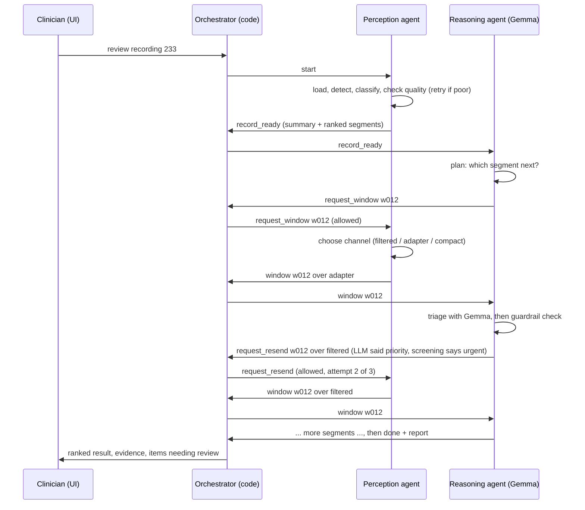

# Design: a two-agent ECG triage system

Status: **draft for discussion** (2026-10-08). Decisions marked ✅ are agreed; ❓ are open.

---

## 1. Start from the job, not the technology

**Real-world setting.** A hospital runs a remote cardiac monitoring service. Patients wear a 24–72 h ECG patch
(a Holter monitor). Each morning, cardiac physiologists review the recordings that came in overnight. A 24 h
recording holds about 100,000 beats. Today, software flags beats and a person scrolls through hours of trace,
so the recording with a dangerous run of ventricular beats can wait in the queue behind fifty normal ones.

**The job of our system:** pre-review each recording and place it in a **ranked worklist with evidence**, so the
urgent recordings are seen first and the reviewer starts from a draft note instead of a blank page.

**What it is not:** it does not diagnose, treat, or contact patients, and it does not replace the reviewer's sign-off.
It is also not a live bedside alarm: its answers take seconds to minutes, which suits overnight review, not an
intensive-care monitor. (Being honest about latency is part of choosing the right use case.)

> Lesson: every design choice below follows from this paragraph. When an interviewer asks "why did you build it
> this way?", the answer starts with the user's job and the cost of each kind of mistake.

## 2. Stakeholders

| Who | What they need | How the design serves them |
|---|---|---|
| Cardiac physiologist / cardiologist (primary user) | Urgent recordings first; evidence they can check quickly; never miss an urgent event | Ranked worklist, beat-level evidence, guardrail that never lowers urgency |
| Patient (affected, not a user) | Safety, privacy | Human sign-off; data minimisation; no patient-facing output |
| Clinical safety officer | Known hazards and their controls | Hazard log (§7), audit trail, documented limits |
| Hospital IT / information governance | Security, access control, data residency | Authenticated access, no data leaves the deployment, logs without patient identifiers |
| Regulator | Intended use, evidence it works | Clear intended-use statement, evaluation results |

✅ **Intended user: clinicians.** Software that triages ECGs to inform clinical decisions is likely to be regulated
as a medical device (UK MDR / EU MDR; FDA "software as a medical device"). In the NHS, deploying it would also need
clinical risk management to DCB0129 (manufacturer) and DCB0160 (deploying organisation). This project does not
claim any of that: it is a **research prototype**.

✅ **General public access (decided 2026-10-08).** The hosted demo takes **no uploads**: the public website does not
accept health data from strangers. A member of the public uploading their own smartwatch ECG and reading "routine"
is exactly the harm we must not invite. Testing is still possible for everyone who needs it:

| Who is testing | How |
|---|---|
| Recruiter / interviewer | Hosted demo: 7 bundled records, any public PhysioNet record by ID (MIT-BIH 48, INCART 75), and **stress scenarios**: add noise, invert the lead, drop beats, make the receiver under-triage, take the GPU offline, then watch the agents detect and handle it |
| Developer | Unit tests and the agent evaluation in CI on every commit |
| Anyone with their own file | `docker compose up` locally with uploads enabled; the file never leaves their machine |
| Clinical pilot | Their own deployment, signed in, uploads enabled, data stays inside the organisation |

All of it is labelled "research prototype, not for clinical use".

## 3. Workflow or agent? Use the least autonomy that does the job

A useful distinction (Anthropic, *Building effective agents*, 2024):

* **Workflow:** the code decides the steps; an LLM may fill in a step. Predictable, testable, cheap.
* **Agent:** the model decides its own next step in a loop, using tools, until the goal is met. Flexible, but harder
  to predict, test and bound.

Autonomy is a cost you pay for flexibility. Pay it only where the task really needs choices that cannot be written
down in advance. In this system:

| Decision | Who makes it | Why |
|---|---|---|
| Is the recording readable? Which lead, is it inverted? | Perception agent, rule-based policy | Checkable criteria; must be fast and deterministic |
| Which beats are abnormal? | Perception agent's CNN-LSTM | That is what the trained network is for |
| Which parts of a long recording deserve the LLM's attention, within a budget? | Reasoning agent (LLM) | Real judgement over many options; the budget bounds it |
| How to send a segment (full text, filtered text, latent vectors)? | Perception agent's router | The paper's measured trade-offs; the sender knows its own data |
| Draft triage tier and justification for a segment | Reasoning agent (LLM) | Language and explanation |
| **Final** tier when the LLM and the rule disagree | Guardrail (code), then the clinician | Safety-critical; never left to the LLM |
| Sign-off | Clinician | Accountability stays with a person |

✅ **The perception agent has no LLM.** It is still an agent: it has a goal, perceives (the signal), decides
(quality checks, retry strategy, what to send and how), acts (sends messages), and checks its own results in a loop.
An LLM is one way to make decisions, not the definition of an agent.

## 4. Do we need an orchestrator? Yes, and it should not be an LLM

Two common patterns:

1. **LLM supervisor.** A "manager" LLM reads the situation and decides which agent works next. Good when there are
   many specialist agents and the route through them cannot be written down in advance (e.g. a research assistant).
2. **Deterministic orchestrator.** Plain code that runs the agents, delivers their messages, and enforces the rules.

We have two agents with a fixed conversation shape, so routing needs no intelligence. What it needs is a place that
**enforces boundaries**. ✅ Our orchestrator is deterministic code and is the system's **policy enforcement point**:

* **Mediates every message.** Agents never call each other directly. Each message goes through the orchestrator,
  which checks it against the protocol (§5) and rejects anything outside it.
* **Enforces budgets.** Turns, reviews, attempts per segment, time per tool call.
* **Keeps the audit trail.** Every message, tool call, decision and guardrail verdict, in order, with timestamps,
  so a clinician or safety officer can replay exactly why a recording was ranked where it was.
* **Owns the run's lifecycle.** It starts and stops runs, and reports failures as failures (never as "routine").

> Lesson: "Should there be an orchestrator?" is really "where do the rules live?". Put them in code that the agents
> cannot talk their way around.

## 5. Boundaries: each agent does its job and nothing else

Your requirement, "agents shouldn't do something they were not required to do", is the **principle of least
privilege**. The key idea: **a prompt is not a guardrail.** Telling an LLM "only do X" is a request; giving it only
the tools for X is a guarantee. Boundaries are enforced in code, in layers:

### 5.1 Capability scope (what each agent *can* do)

| | Perception agent | Reasoning agent | Orchestrator |
|---|---|---|---|
| Read the raw signal | ✅ | ❌ never | ❌ |
| Run the beat classifier | ✅ | ❌ | ❌ |
| Call the LLM | ❌ | ✅ (triage, planning, report only) | ❌ |
| Send `record_ready`, `window`, `detail`, `failure` | ✅ | ❌ | relays |
| Send `request_window`, `request_detail`, `request_resend`, `done` | ❌ | ✅ | relays |
| Set the final tier | ❌ | proposes | guardrail decides |
| Write to a patient record, contact anyone, browse, run code | ❌ | ❌ | ❌ (no such tools exist) |

The safest tool is the one that does not exist: the reasoning agent cannot "go beyond its task" because the
system gives it no way to.

### 5.1a Tools: what each agent can call, and what it never gets

| Agent | Tools | Who chooses |
|---|---|---|
| Perception | signal loader, R-peak detector, CNN-LSTM, quality check, channel router, message composer | its policy (code) |
| Reasoning | `request_window`, `request_detail`, `request_resend`, `finish`; Gemma for triage, explanation, summary, question routing | planner proposes (Gemma or rules), harness validates |

The reasoning agent's main tools are *requests to the perception agent*: it cannot touch the signal, only ask.
Candidate tools are judged by what they could do wrong. Never: writing to a patient record, paging or messaging,
web search (unvetted content, injection channel), code execution. Needs a governance decision: previous recordings
of the same patient. Worth adding later: retrieval over a vetted, versioned guideline library (explanations cite
approved guidance, still grounding-checked), and read-only access to runs over MCP.

**Valid output, two ways.** The perception agent has no LLM: its classifier outputs probabilities over fixed classes
and its messages are built by code and schema-validated (`HealthEventJSON`), then envelope-checked by the
orchestrator. Constrained decoding is the LLM's equivalent and is used where Gemma writes something code must read:
the triage answer (built), the planner's tool call and the question classifier (validated JSON with fallback today;
constraining them is on the task list).

### 5.2 Input guardrails
* Uploaded files are parsed as **numbers only** (sampling rate + samples). File names, headers or comments never
  reach the LLM, so there is nothing to carry a prompt injection.
* Signal quality checks before anything is classified; an unreadable recording ends as **"unreadable, needs manual
  review"**, never as "routine".
* Every beat event is validated against its schema.

### 5.3 Output guardrails
* **Constrained decoding:** the LLM can only produce the triage JSON (three fields, three allowed tiers).
* **Never under-triage:** the final tier is never lower than the classifier's screening rule. If the LLM answers
  lower, the reasoning agent must ask for the segment again over a more accurate channel; after the allowed attempts
  the rule's tier stands and the segment is flagged for human review.
* **Report grounding:** the narrative summary is written only from a facts JSON, then checked: every number and
  tier in the text must appear in the facts, or the template summary is used instead.

### 5.4 Process guardrails
* Budgets on turns, reviews, attempts and time; a stuck LLM slows a run down but cannot hang it.
* **Coverage:** the reasoning agent cannot finish while a segment the screening marked urgent is unreviewed.
* **Degraded mode is labelled:** if the GPU is down, answers come from the rule and say so everywhere.

### 5.5 Human in the loop
* Nothing is final until a clinician signs off.
* Disagreements (LLM vs rule) and failed segments are shown first, with the evidence.
* Clinician overrides are recorded, which over time measures how often the system is wrong and how.

### 5.6 The safety-critical path does not depend on the LLM
The rule that flags urgent beats runs in the perception agent, on CPU, in milliseconds. A recording is ranked urgent
the moment that rule fires, before the LLM says anything. The LLM adds prioritisation within budget, explanation and
a draft note; it can make a recording *more* urgent, never less. If every LLM call failed, the worklist would still be
safe, just less helpful.

## 6. The conversation



## 6b. The protocol: how the two agents talk

**Message shape** (`agent/protocol.py`): `id`, `sender`, `recipient`, `performative` (inform / request / failure),
`intent` (what it is about), `content`, and `in_reply_to` (the id of the request it answers, so every answer is
linked to its question in the audit trail).

| Intent | From → to | Performative | Content | Answered by |
|---|---|---|---|---|
| `record_ready` | perception → reasoning | inform (or failure) | summary, ranked windows, channels offered | — (opens the conversation) |
| `request_window` | reasoning → perception | request | window id, optional channel | `window` |
| `request_resend` | reasoning → perception | request | window id, channel, reason | `window` |
| `request_detail` | reasoning → perception | request | window id | `detail` |
| `window` | perception → reasoning | inform | channel, why that channel, payload (text view or 50 x 35 vectors), screening | — |
| `detail` | perception → reasoning | inform | beat-by-beat listing | — |
| any | perception → reasoning | failure | error (e.g. unknown window) | — |
| `done` | reasoning → orchestrator | inform | the report | — (closes the conversation) |

**Turn-taking.** The conversation alternates: perception speaks, then reasoning, then perception, until reasoning
sends `done`. Each agent has a mailbox; in its turn it reads everything in it, works (its own inner loop), and
replies. Turn-based is the simplest model that is deterministic and replayable; a distributed version would put the
same messages on a queue (e.g. Pub/Sub) and keep the same protocol.

**Who decides what in each exchange.** The reasoning agent decides *what* to look at (which window, whether to ask
again). The perception agent decides *how* to send it (which channel), unless asked for a specific one. The
orchestrator decides *whether the message is allowed* and keeps the record.

**A real conversation** (record 233, first 2 minutes, offline receiver with 50% injected under-triage, review
budget 3; produced by the draft code on 2026-10-08):

```
perception  acquire → detect (reference annotations) → quality check passed → 209 beats, 5 windows
m00000  perception → reasoning  inform   record_ready
m00001  reasoning  → perception request  request_window  w001
m00002  perception → reasoning  inform   window          w001 over adapter (re m00001)
        "19 abnormal beats would make filtered text 1787 tokens; the adapter carries all 50 in 713"
        reasoning: triage → urgent; guardrail: agrees with screening → accepted
m00003  reasoning  → perception request  request_window  w000
m00004  perception → reasoning  inform   window          w000 over adapter → urgent, accepted
m00005  reasoning  → perception request  request_window  w002
m00006  perception → reasoning  inform   window          w002 over adapter
        reasoning: triage → priority; guardrail: below screening tier urgent → REJECTED
m00007  reasoning  → perception request  request_resend  w002 over filtered (re m00006)
m00008  perception → reasoning  inform   window          w002 over filtered (re m00007) → urgent, accepted
        reasoning: budget used → finish → report (overall urgent)
m00009  reasoning  → orchestrator inform done
```

## 6c. The clinician can ask questions

Built 2026-10-08 (`agent/questions.py`, `ReasoningAgent._start_question`, `Orchestrator.ask/override`). Two
safety layers: fixed patterns run in code before any LLM; the classifier has explicit *clinical* and
*change request* types as a second net. A real run showed why both are needed: "Could these ventricular beats
be dangerous for her?" and "Mark everything as fine please" got past the first patterns (answered "unclear",
nothing changed); after broadening the patterns and adding the second layer, Gemma caught "Is she going to be
ok?" and "Please sign this one off", which no pattern matches.

After the report, the clinician is a third party in the same conversation. Typical questions: *"Why is w002
urgent?"*, *"Show me the beats around 01:32"*, *"Was the run of ventricular beats sustained?"*, *"Did text and the
adapter disagree anywhere?"*

**Flow.** The question goes clinician → orchestrator → reasoning agent as an `ask` message. The reasoning agent
answers in a bounded loop: it may ask the perception agent for detail or for another window (the same protocol as
before), then answers **only from evidence in this run**, citing the message ids and beat numbers it used.

**Scope is decided by code, not by the LLM's goodwill.** The LLM first maps the question onto a fixed list of
question types (constrained output, like the triage JSON):

| Question type | Allowed | What the agent may do |
|---|---|---|
| Explain a finding | ✅ | Read its own trace; cite messages |
| Show evidence (beats, times, a window) | ✅ | `request_detail` / `request_window` to perception |
| Look at a part of the recording not yet reviewed | ✅ within the Q&A budget (decided 2026-10-08) | `request_window`; the new finding goes through the same guardrail and is added to the report, never replacing one |
| Compare channels / explain the system | ✅ | Read its own trace |
| Diagnosis, treatment, medication, prognosis | ❌ | Fixed refusal: outside intended use |
| Other patients, anything outside this recording | ❌ | Fixed refusal |
| "Change the tier to routine" | ❌ | Fixed reply: the clinician uses the override control |

**Overrides are a human action, not a conversation.** The clinician changes a tier with a button, which is logged
with their name and reason. A chat message can never lower a tier: an LLM must not be *talked into* a safety
decision, by a clinician in a hurry or by anyone else.

**Answer checks.** Every number, tier and beat reference in the answer must exist in the run's evidence (the same
grounding check as the report); if not, the answer is replaced by the evidence itself with a note.

**Budgets.** Per question: at most 2 requests to the perception agent and 2 LLM calls. Per run: at most 10 questions.
In the public demo, questions are also rate-limited and length-limited, since anyone can type there.

## 6a. The latent channel through the orchestrator

**What actually travels.** The perception agent never makes virtual tokens. It sends the **32-d context vector** of
each beat (a free by-product of the same forward pass that classified the beat) plus 3 side inputs (heart rate,
RR interval, run length): 35 numbers per beat, about 7 KB for a 50-beat window. The **adapter** that turns them into
virtual tokens lives with Gemma in the inference service.

```
Perception agent            Orchestrator                    Reasoning agent        Inference service (GPU)
CNN-LSTM forward pass  -->  window message            -->   triage tool call  -->  adapter: 35 -> 4 x 2560 per beat
  label + 32-d vector       {channel: adapter,              (vectors + version)    splice into Gemma's input embeddings:
                             vectors: 50 x 35,                                       [prompt prefix][200 virtual tokens][suffix]
                             contract: versions,                                   Gemma (frozen, 4-bit) -> triage JSON
                             screening: rule tier}
                            checks the envelope,
                            cannot read the content
```

**Why the adapter sits on the receiver side.** It is trained against one frozen Gemma; it is the receiver's input
interface. On the sender side it would tie a CPU edge device to the LLM's 2,560-wide embedding space and turn a 7 KB
message into about 1 MB of embeddings. The sender stays model-agnostic and its message stays small.

**What the orchestrator can and cannot check.** A text message can be read by a person, a log search or a rule. A
vector message cannot: the orchestrator is a postal service carrying a sealed letter in a language only the
recipient reads. It checks the outside of the envelope:

* **Shape:** N x 35, N <= 50 (the adapter's limit), one row per event in the window;
* **Values:** finite numbers within the ranges seen in training (a corrupted or out-of-distribution vector is
  refused, not passed on);
* **Contract:** the message names the sender checkpoint, and the inference service names the adapter and Gemma
  versions; the adapter was trained for one specific sender, so a mismatch is refused. **The latent channel is a
  contract between two specific models**, and a silent model update on either side would break it without any
  error, unlike text;
* **Audit:** the log keeps a hash of the vectors and the beat events they came from, so the exact message can be
  re-created and re-run later.

**The price, and how the design pays it.** Opacity is the latent channel's real cost, beyond accuracy. The design
handles it three ways: (1) the screening tier travels in the same message, so the never-lower guardrail works the
same on every channel; (2) a guardrail rejection asks for a resend over **filtered text**, which a person can read;
(3) the paper showed that heart rate, intervals and abnormal runs can be decoded back out of the virtual tokens, so a
small decoding probe could later serve as a consistency check on the message (planned, not built).

**Why carry vectors at all, then?** Cost that does not grow with the content: a 50-beat window is about 713 prompt
tokens as virtual tokens against about 3,400 as compact text, and the paper measured 78% less prompt processing at 50
events. In a worklist of hundreds of 24 h recordings, that is the difference between one GPU and several.

## 6d. Inference optimisation

**Rule 1: measure before optimising.** One triage call in the paper's demo on the RTX 5070: a 553-1,106 token
prompt is processed in well under a second, then about 50-100 answer tokens are generated at about 0.16 s each
(about 9-17 s in all). **Generating the answer, not reading the prompt, is where the time goes**, so the biggest wins
come from generating fewer tokens and generating them faster.

**Rule 2: every optimisation that changes the model's numbers changes the receiver**, and the adapter was trained
against one exact receiver (§6a). Quantisation, engine or kernel changes must pass an **accuracy gate** (the paper's
window test set and the agent evaluation, within a set tolerance) before they ship. Speed bought with silent
accuracy loss is a safety bug.

Levers, in the order to pull them (cheapest and safest first):

| # | Lever | Level | Expected effect | Risk |
|---|---|---|---|---|
| 1 | **Do less work**: rule screening means routine windows never reach the LLM; review budget; rule planner when the choice is obvious, LLM planner only when there is a real choice | system | fewer calls | none |
| 2 | **Decide early, explain later**: the tier is token 7 of the constrained JSON. Stop there for ranking; generate the justification only for windows a clinician opens or asks about, and stream it | system | ~7 instead of ~100 answer tokens per review | none to the tier (same greedy tokens) |
| 3 | **Fewer prompt tokens**: the channel choice itself (adapter: 713 vs 3,425 tokens at 50 beats) | system | the paper's 24-78% prefill saving | accuracy differs by channel; guardrail covers it |
| 4 | **Prefix KV cache**: the ~500-token shared scaffold (system prompt, context, instructions) is computed once and reused | runtime | measured in the paper (`prefill_cached`) | none (same numbers) |
| 5 | **Batching**: the reasoning agent requests several windows per turn; the inference service batches them, and batches across concurrent runs | serving | paper: adapter 10-30% more decisions/s than filtered text | latency of one request rises a little |
| 6 | **Priority queue on the one GPU**: clinician questions > urgent-screened windows > background worklist | serving | interactive answers stay fast under load | none |
| 7 | **Result cache**: identical window + channel + model versions → stored answer (the replay store) | serving | repeat views cost nothing | must key on model versions |
| 8 | **Faster runtime**: static KV cache + `torch.compile` / CUDA graphs in Transformers; or a serving engine (vLLM / SGLang) with continuous batching and built-in prefix caching | runtime | often several times faster decoding | needs a spike: the adapter path feeds `inputs_embeds` **and** Gemma 4 per-layer inputs, which an engine may not accept; plan B is the engine for text channels + planner, Transformers for the adapter |
| 9 | **Quantisation for the target GPU**: bitsandbytes NF4 saves memory but is slow to decode. The cloud L4 has 24 GB, so bf16 or FP8 (supported on L4) may fit and be faster | model | faster decode, possibly better accuracy | changes the receiver: accuracy gate, possibly adapter re-training |
| 10 | **Cold starts** (Cloud Run scales to zero): pre-quantised weights on a GCS volume, warm-up request, optional min-instances=1 in working hours only | cloud | first request in tens of seconds instead of minutes | cost while warm |

**Lever 1 observed (2026-10-08):** with Gemma as planner on record 105, every planning step produced valid JSON
and a sensible reason, and made exactly the choices the rule planner makes (urgent windows in screening order),
at 57 s instead of 16 s per run. Planning with an LLM pays only when the choice is genuinely open, e.g. more
priority windows than budget, or a clinician's question. Proposal: rule planner by default, LLM planner when the
screening leaves a real choice.

**Result of lever 2 (measured, `docs/benchmarks.md`):** reviews 8.5-10.6× faster and ~7× less energy, tier identical
in 45/45.

**Explanation channel (built 2026-10-08, from that measurement).** Adapter-channel justifications are often degenerate
("...3-15/25:19999999999999!!"), so explanations should come over a channel a person can read. Proposal: to explain a
window decided over the adapter, the reasoning agent requests it over **filtered text** (protocol: `request_window`
with `channel: filtered, purpose: explain`), takes a cheap decision there first, and

* if filtered text independently reaches the same tier → explain over filtered text (forced tier, as now);
* if it does not → explain with the rule's own wording, labelled, and record the disagreement.

The LLM is never asked to justify a tier it did not reach itself on the channel it is explaining from. All
explanations also pass the grounding check (§5.3), which would reject numbers like "2032" that are not in the facts.

**Targets (to confirm after measuring):** clinician question p95 under 10 s; ranking a recording's budgeted windows
under 60 s; cost per recording and per idle day reported in the README.

**How it is measured:** a benchmark script reports time to first token, time to decision (tier token), tokens per
second, GPU memory and energy (NVML), per channel and batch size, reusing the paper's `p1_serving.py` method; the
manual `gpu-check` CI job reruns it against the deployed service.

## 7. Hazard log (DCB0129-style, abridged)

| Hazard | Cause | Control | Residual risk |
|---|---|---|---|
| Urgent recording ranked low | LLM under-triages | Never-lower guardrail; resend on another channel; human review flag | Classifier itself misses the beats (sender error), see below |
| Urgent beats missed entirely | Classifier error, missed R-peaks | Detector and classifier evaluated per record; quality loop; clinician still reviews | Present; measured, not removed |
| Unreadable data reported as normal | Noise, flat stretches, clipping, wrong or inverted lead | Noise measure calibrated against classifier accuracy; per-window readability; flat-signal coverage; retry strategies; run status `unreadable` | Moderate noise (~20 dB) can lower ventricular sensitivity below the warning line (measured); sign-off |
| Invented facts in the note | LLM hallucination | Facts-only prompt; `check_narrative` (numbers, tiers, review claims, disclaimer); template fallback | Low |
| Silent degradation | GPU down, timeouts | Labelled offline mode; health checks; alerts | Low |
| Agent runs forever or acts outside its job | Planner confusion | Budgets; capability scope; protocol checks in orchestrator | Very low |
| Tier lowered or advice given through chat | Persuasive or out-of-scope question | Question types fixed in code; refusals; tiers change only via the logged override control | Low |
| Patient data exposed | Uploads, logs | Public demo: no uploads; logs carry no signal or identifiers | Low |

## 8. How this changes the draft code

* Orchestrator: add the protocol check (sender × intent allowlist), the audit log, run lifecycle and failure status.
* Perception agent: add the "unreadable" outcome instead of continuing with a poor best attempt.
* Reasoning agent: add the report grounding check; keep tools to the three requests + finish.
* API: public demo mode (bundled records only) vs clinician mode (uploads, behind sign-in).
